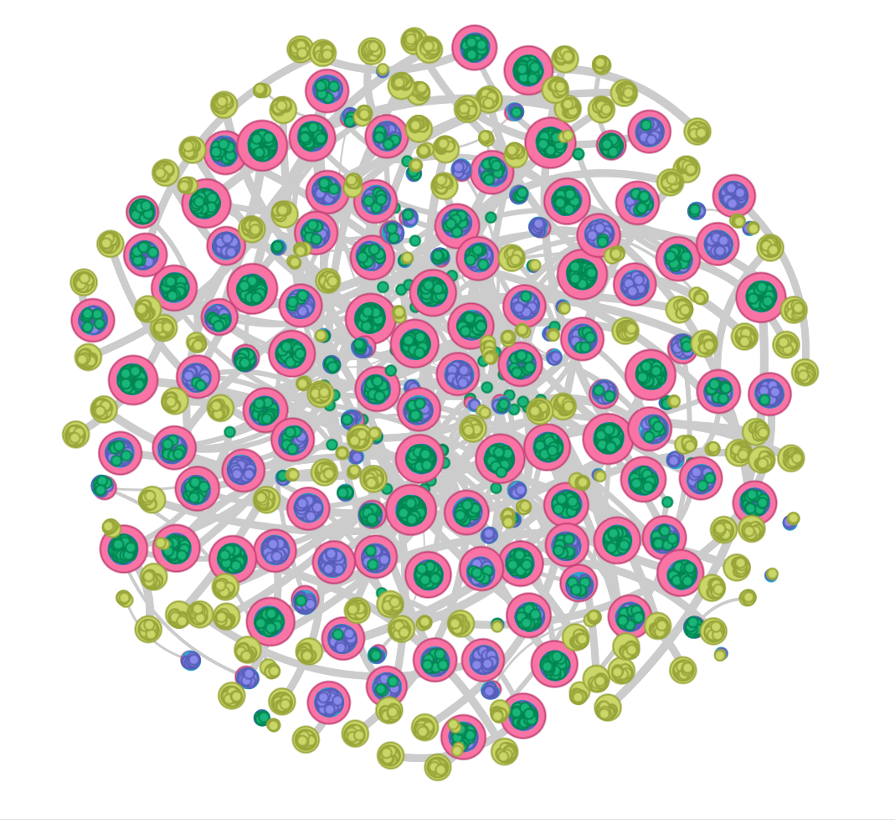
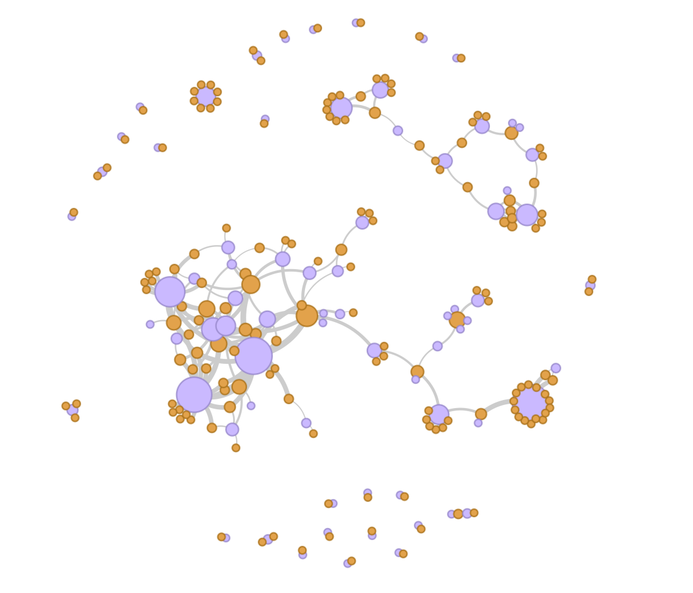
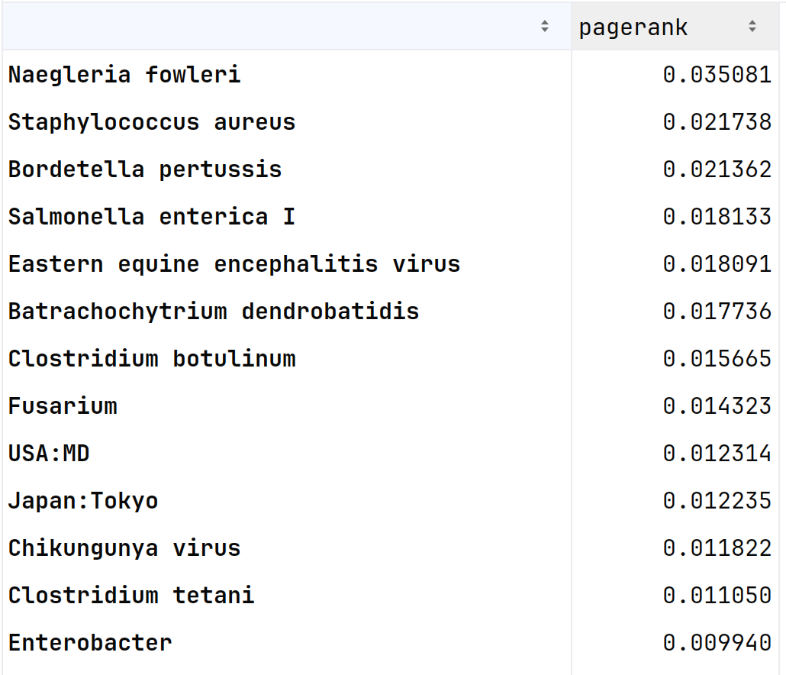

# README

## Code 

The initial ETL code is in curl2RDF.py in the root of the repository.

### Execution Process

1. Run the code with ```python curl2RDF.py```
2. The code currently returns the fields: _run_accession, experiment_title, tax_id, country, description_.  Future updates will make this configurable
2. The results will be placed in data/output as a collection of RDF files encoded in n-triples named by the run_accession alphanumeric character string.  
3. From there the data can be loaded into the Qlever using the commands documented in the section _Commands for running Qlever instance_.


The code was developed over the course of the three-day codeathon, so 
there are several elements that should be addressed.  

1. The REST call for taxon id is hard coded into the function. The only 
parameters passed are the taxon id and request limit for the number of resources
2. The JSON-LD template is read from [Pathogen_schemav2.json](../data/Pathogen_schemav2.json). This template approach will be replaced once the profile is more refined.  See
the following section named _RDF Generation and evolution suggestions_ for details on approaches for more efficient triple generation. 


## RDF Generation and evolution suggestions

During the codeathon, a simple JSON-LD document was created as a template.  This represents a reference profile for encoding the ENA Taxon REST call results.

That document was then used by the code and modified via JSON path expressions to update or prune
nodes based on data values.  This is slow and fragile.
Once a profile is settled on, a function can be developed that will
leverage direct generation of triples.  

Examples that could be used include RDFlib (https://rdflib.readthedocs.io/en/stable/intro_to_creating_rdf.html) PyOxigraph(https://pyoxigraph.readthedocs.io/en/stable) or, recommended, the new Pyjelly (https://github.com/jelly-rdf/pyjelly) package which is focused specifically on large scale data dumps and performant streaming. 

Example in Pyjelly

```python
import pyjelly  # Assuming import; check repo for exact usage

# Hypothetical example; consult docs for API
graph = pyjelly.Graph()
graph.add("https://example.org/person/alice", "https://example.org/name", "Alice")
serialized = graph.serialize("jelly")  # Fast serialization
```

## Future Semantic Connections

The decision was made to leverage schema.org and the
associated bioschema.org as the foundation for the profile.

This approach also allows for future alignment with other 
projects, beyond bioschema.org, that are using schema.org as 
a based layer for profiles.  These include:

MLCommons Croissant and GeoCroissant:
* https://mlcommons.org/working-groups/data/croissant/

CODATA Cross Domain Interoperability Framework (CDIF):
https://cross-domain-interoperability-framework.github.io/cdifbook/introduction.html


Earth Science Information Partners (ESIP) Science on Schema.org (SOSO).
https://github.com/ESIPFed/science-on-schema.org/tree/1.3.1

## Running Qlever triplestore

The [Qlever triplestore](https://github.com/ad-freiburg/qlever) was selected 
for the project for ease of use in the codeathon setting. 
None of the SPARQL queries use vender-specific 
functions, so any triplestore would work in its place.

We also use the [Qlever-control](https://github.com/qlever-dev/qlever-control) as the primary CLI for administering the 
server.  

### Commands for running Qlever instance

These need to be run from  ./triplestore/BV-BRC

Review the configuration files [Qleverfile](../triplestore/BV-BRC/Qleverfile) 
and [Qleverfile-ui.yml](../triplestore/BV-BRC/Qleverfile-ui.yml) to set the host name and ports you wish to use.  

Also, take note of the data source and copy commands that 
are relevant to the ```get-data``` and ```index``` commands in qlever.  

**Do not run get data unless you need to build a new index**
```bash
qlever get-data
```

**Do not run index unless you need to build a new index**
```bash
qlever index --overwrite-existing
```

```bash
qlever start
```

```bash
qlever stop
```

```bash
qlever ui
```


# Visualizations

An example of *type to type* relation image for the test graph.

The code to query and transform the results for these visuilizations 
and example pagerank are in [rdfGraphs.ipynb](../triplestore/graphlpg/rdfGraphs.ipynb)



Network showing relation between pathogen and spatial location



Example of pagerank values for the network of the pathogen to spatial location network



